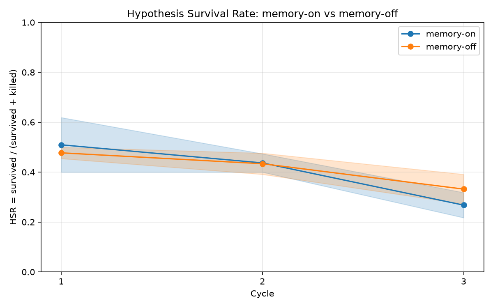

# P5 Evidence — Memory Ablation Harness

**Date:** 2026-07-07
**Session goal:** the ablation harness that tests SERA's core claim — does
accumulated memory measurably improve hypothesis quality? Metric: HSR =
survived / (survived + killed), failures excluded.

## Task 0 — P4 pending live evidence: CREDITS-STILL-EMPTY

Preflighted with a minimal API call before any build work:

```
anthropic.BadRequestError: Error code: 400 - {'type': 'error', 'error':
{'type': 'invalid_request_error', 'message': 'Your credit balance is too low
to access the Anthropic API. Please go to Plans & Billing to upgrade or
purchase credits.'}}
```

The two live JSON-parsing asks + `sera memory stats` from
`docs/evidence/p4.md` remain pending until credits are added. Task 0
skipped per instructions.

## `sera ablate --dry-run --cycles 3 --repeats 2`

Full run (exit 0). Head:

```
Plan: 8 briefs x 3 cycles x 2 arms x 2 repeats = 96 asks (~288 generated experiments)
Dry run: deterministic offline mock — no API calls, no cost.
arm=on repeat=1 cycle=1/3 brief=ab-001
arm=on repeat=1 cycle=1/3 brief=ab-002
... (96 progress lines total: 8 briefs × 3 cycles × 2 arms × 2 repeats)
```

Tail — summary table:

```
               Hypothesis Survival Rate (memory ablation)
┌────────────┬───────┬──────────┬─────────┬──────────┬────────┬────────┐
│ Arm        │ Cycle │ HSR mean │ HSR std │ Survived │ Killed │ Failed │
├────────────┼───────┼──────────┼─────────┼──────────┼────────┼────────┤
│ memory-on  │     1 │   0.5095 │  0.1095 │       21 │     20 │      7 │
│ memory-on  │     2 │   0.4369 │  0.0368 │       17 │     22 │      9 │
│ memory-on  │     3 │   0.2678 │  0.0504 │       12 │     33 │      3 │
│ memory-off │     1 │   0.4773 │  0.0227 │       22 │     24 │      2 │
│ memory-off │     2 │   0.4337 │  0.0425 │       19 │     25 │      4 │
│ memory-off │     3 │   0.3320 │  0.0593 │       15 │     30 │      3 │
└────────────┴───────┴──────────┴─────────┴──────────┴────────┴────────┘
  memory-on overall HSR: 0.4000
  memory-off overall HSR: 0.4148
  Curve:   experiments/ablation/runs/20260707T064521Z/ablation_curve.png
  Data:    experiments/ablation/runs/20260707T064521Z/ablation_curve.csv
  Summary: experiments/ablation/runs/20260707T064521Z/summary.json
```

**Honest note:** dry-run verdicts are hash noise by design — the two arms
SHOULD look statistically indistinguishable here. This validates the
pipeline (bookkeeping, isolation, math, rendering), not the memory claim.
The real claim test needs API credits.

### Artifacts produced (all confirmed on disk)

```
ablation_curve.csv     308 bytes
ablation_curve.png   63862 bytes   (copied to docs/evidence/p5-ablation-curve-dryrun.png)
ledger-off-r1.jsonl  44765
ledger-off-r2.jsonl  44807
ledger-on-r1.jsonl   44257
ledger-on-r2.jsonl   44322
results.jsonl        55309        (288 rows: one per hypothesis outcome)
summary.json          3914
```

Four distinct isolated ledgers — one per arm×repeat — proving arms can
never contaminate each other (`SERA_LEDGER_PATH` override in
engine/ledger.py). Long-format CSV (arm,cycle,repeat,hsr,survived,killed,
failed) for re-plotting; curve PNG has one line per arm with ±std error
bands.



## Full pytest tail

```
128 passed in 4.98s
```

New in this session: `tests/test_ablation.py` — arm isolation (memory-off
never calls `ledger.query`; distinct ledger files; env var restored), HSR
math (failures excluded; mean/pstdev across repeats), dry-run end-to-end
artifact shapes, dry-run determinism, and cycle/brief-coverage bookkeeping.

## git diff --stat

```
 cli/commands/ablate.py                     |  93 ++++++++
 cli/main.py                                |   2 +
 docs/evidence/p5-ablation-curve-dryrun.png | Bin 0 -> 63862 bytes
 docs/evidence/p5.md                        |  97 ++++++++
 engine/ablation.py                         | 356 +++++++++++++++++++++++++++++
 engine/ledger.py                           |   8 +
 experiments/ablation/briefs.jsonl          |   8 +
 requirements.txt                           |   2 +-
 tests/test_ablation.py                     | 281 +++++++++++++++++++++++
 12 files changed, 875 insertions(+), 1 deletion(-)
```
(plus .gitignore + .nemp session-memory files)
