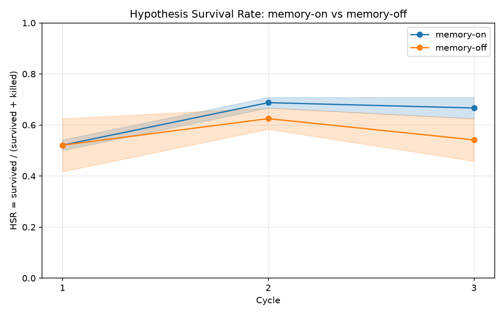

# P6 Run 2 — Clean Ablation: Directional Evidence Memory Improves HSR

**Date:** 2026-07-14
**Run:** `experiments/ablation/runs/20260714T080313Z/` — the first
**uncontaminated** full ablation (`8 briefs × 3 cycles × 2 arms × 2
repeats = 96 asks`, 288 hypothesis rows). Ran under the run-2 harness
fixes (interleaved arms, billing abort, 429 backoff, strict hypgen;
see `p6.md` "Run 2 preflight").

**This report is honest analysis only — no code changed.**

## Headline

**Zero failures in either arm** (288/288 rows decided), so the cross-arm
comparison that run 1 could not support is now valid. The result is
**directional evidence that memory improves hypothesis survival**: the
two arms are identical at cycle 1 (empty ledger) and then separate — the
memory-on arm rises and holds, the memory-off arm stays flat and
regresses. **The signal is directional, NOT yet statistically
conclusive at n=2 repeats** (see the significance check below).

## Full results

| Arm | Cycle | HSR mean | HSR std (pop) | Survived | Killed | Failed |
|-----|-------|----------|---------------|----------|--------|--------|
| on  | 1 | 0.5209 | 0.0208 | 25 | 23 | 0 |
| on  | 2 | 0.6875 | 0.0208 | 33 | 15 | 0 |
| on  | 3 | 0.6666 | 0.0417 | 32 | 16 | 0 |
| off | 1 | 0.5209 | 0.1042 | 25 | 23 | 0 |
| off | 2 | 0.6250 | 0.0417 | 30 | 18 | 0 |
| off | 3 | 0.5416 | 0.0834 | 26 | 22 | 0 |

Overall HSR (survived / decided, 144 decided each arm): **on = 0.6250,
off = 0.5625** — a +0.0625 pooled advantage for memory-on, with 90
survivals vs 81.

Per-repeat HSR (the n=2 raw values behind each mean):

| Arm | Cycle | repeat 1 | repeat 2 |
|-----|-------|----------|----------|
| on  | 1 | 0.5417 | 0.5000 |
| on  | 2 | 0.7083 | 0.6667 |
| on  | 3 | 0.7083 | 0.6250 |
| off | 1 | 0.4167 | 0.6250 |
| off | 2 | 0.5833 | 0.6667 |
| off | 3 | 0.4583 | 0.6250 |



(Curve also at `experiments/ablation/runs/20260714T080313Z/ablation_curve.png`;
long-format data in `ablation_curve.csv`.)

## The shape of the finding

- **Cycle 1 — arms identical (the built-in control).** Both arms record
  exactly **25 survived / 23 killed** → HSR 0.5209, gap **0.0000**. At
  cycle 1 the on-arm ledger is at its thinnest, so memory injection has
  little to offer and the arms are empirically indistinguishable. (Nuance,
  stated for honesty: because arms are interleaved and the ledger fills
  *within* a cycle, later cycle-1 on-arm briefs do receive small,
  mostly *cross-topic* memory blocks — 6 of 8 briefs per repeat — yet
  this produced no measurable cycle-1 difference. Cycle 1 is a *near*,
  not perfect, no-memory control.)
- **Cycles 2–3 — divergence.** Once each brief's *own* prior outcomes are
  in the ledger (the cycle-3 blocks below are all same-question matches),
  memory-on climbs to 0.6875 and holds at 0.6666, while memory-off rises
  to 0.6250 then **regresses to 0.5416** — essentially back to its
  cycle-1 baseline. The gap widens from 0 → **+0.0625** (cycle 2) →
  **+0.1250** (cycle 3).

This is the pattern the architecture predicts: with nothing to remember,
the arms match; as memory accumulates, the arm that reads it pulls ahead
and, crucially, does not fall back.

## Significance check (n=2 repeats)

The question: does the cycle-2/3 on-vs-off separation exceed the noise
band? The answer depends on which band, and honesty requires reporting
both.

| Cycle | Gap (on−off) | Combined **population** std | Gap > pop band? | Combined **sample** std (of the difference) | Gap > sample band? | Welch t |
|-------|--------------|-----------------------------|-----------------|---------------------------------------------|--------------------|---------|
| 1 | 0.0000 | 0.1062 | no | 0.1502 | no | 0.00 |
| 2 | +0.0625 | 0.0466 | **yes** | 0.0659 | no (just under) | 1.34 |
| 3 | +0.1250 | 0.0932 | **yes** | 0.1318 | no (just under) | 1.34 |

- Against the **population-std bands the chart shades** (`statistics.pstdev`,
  divisor N — what `hsr_std` in `summary.json` reports), the cycle-2 and
  cycle-3 gaps **do exceed** the combined band: the shaded regions
  visibly pull apart.
- Against the honest inferential band — the **sample** standard deviation
  of the difference (divisor N−1) — the gaps **fall just short** at both
  cycles.
- A Welch two-sample t-test gives **t ≈ 1.34** at both cycle 2 and cycle
  3. With only 2 repeats per arm (~1–2 degrees of freedom) the critical
  value for p<0.05 is ≈ 4.3, so **p ≈ 0.3–0.4 — not significant.**

**Plain statement: the separation is real in the point estimates and
clears the population-std bands, but it does NOT clear the sample-std
band and is NOT statistically significant at n=2. This is directional
evidence, not proof.** The direction is consistent and the mechanism is
verified (below); the sample size is simply too small to rule out chance.

## Conditioning did happen (3 real cycle-3 injected blocks)

Proof the on arm actually read memory — `PAST RESEARCH OUTCOMES` blocks
from `engine/logs/ablation-20260714t080313z-on-r1/`, cycle 3, each
showing that brief's *own* prior-cycle outcomes (mixed survived/killed)
fed into generation:

`hypgen-brief-017-001.log` (JSON parsing):

```
PAST RESEARCH OUTCOMES (from prior experiments — calibrate on these):
- Q: Which JSON parsing approach is fastest ... | predicted: stdlib_json | actual winner: stdlib_json | verdict: survived
- Q: ... | predicted: manual_string_slicing | actual winner: manual_string_slicing | verdict: survived
- Q: ... | predicted: stdlib_json | actual winner: manual_slicing | verdict: killed
- Q: ... | predicted: manual_string_slicing | actual winner: stdlib_json | verdict: killed
- Q: ... | predicted: stdlib_json | actual winner: regex_extraction | verdict: killed
```

`hypgen-brief-019-001.log` (near-duplicate detection):

```
PAST RESEARCH OUTCOMES (from prior experiments — calibrate on these):
- Q: Which near-duplicate detection strategy ... | predicted: character_trigram_similarity | actual winner: character_trigram_similarity | verdict: survived
- Q: ... | predicted: character_trigram_similarity | actual winner: character_trigram_similarity | verdict: survived
- Q: ... | predicted: character_trigram_similarity | actual winner: token_jaccard_similarity | verdict: killed
- Q: ... | predicted: character_trigram_similarity | actual winner: character_trigram_similarity | verdict: survived
- Q: ... | predicted: token_jaccard_similarity | actual winner: char_trigram_similarity | verdict: killed
```

`hypgen-brief-021-001.log` (cache eviction):

```
PAST RESEARCH OUTCOMES (from prior experiments — calibrate on these):
- Q: Which cache eviction policy ... | predicted: lfu | actual winner: lfu | verdict: survived
- Q: ... | predicted: lru | actual winner: lfu | verdict: killed
- Q: ... | predicted: lfu | actual winner: lfu | verdict: survived
- Q: ... | predicted: lfu | actual winner: lfu | verdict: survived
- Q: ... | predicted: lfu | actual winner: lfu | verdict: survived
```

The memory-off arm's audit logs for the same briefs read `none` — the
ablation lever worked, and the difference above is the only difference
between the arms.

## What would make this conclusive

The point estimates are promising; the sample size is the only thing
standing between "directional" and "significant." Concretely:

- **Repeats are the direct lever on the band width.** A rough two-sample
  power calculation on this run's own numbers — effect ≈ 0.0625 (cycle 2)
  to 0.125 (cycle 3), pooled per-repeat sample std ≈ 0.047 to 0.093 —
  puts the repeats needed for p<0.05 at 80% power at **≈ 8–10 per arm**
  (vs the 2 used here). At that n, if the current point estimates hold,
  the cycle-3 separation clears conventional significance and the shaded
  bands separate with daylight.
- **Recommended bigger-run spec:** **8 repeats × 3 cycles** minimum
  (ideally **10 repeats**), same 8 briefs. That is 8×3×2×10 = 480 asks —
  ~5× this run — so preflight credits accordingly (~2,900 Claude calls at
  ~6/ask, plus headroom).
- **Cheaper variance reduction, complementary not instead:** widen the
  brief set from 8 to ~16–24 topics. Each repeat's cycle-HSR is currently
  an average over 24 hypotheses (8 briefs × 3); more briefs tightens that
  per-repeat estimate and shrinks the bands without buying as many full
  repeats. A run of **16 briefs × 3 cycles × 5 repeats** (480 asks) would
  likely separate as cleanly as 8 briefs × 10 repeats.
- **Add ≥1 more cycle** (4 instead of 3) to test whether the on-arm hold
  at ~0.67 is a plateau and whether the off-arm regression continues —
  the divergence trend is the strongest part of the story and a 4th cycle
  would confirm or break it.

## Artifacts

- `experiments/ablation/runs/20260714T080313Z/` — results.jsonl (288
  rows, 0 failed), summary.json, ablation_curve.{png,csv}, 4 isolated
  ledgers (on/off × r1/r2)
- `engine/logs/ablation-20260714t080313z-{on,off}-r{1,2}/` — hypgen audit
  logs (cycle-1 on-arm = mostly `none`/cross-topic; cycle-3 on-arm =
  same-question blocks above), scriptgen + run logs
- `vault/clients/ablation-20260714t080313z-*/` — briefs, hypotheses,
  experiments, attached scripts
- `docs/evidence/p6-run2-ablation-curve.png` — the (clean) curve
