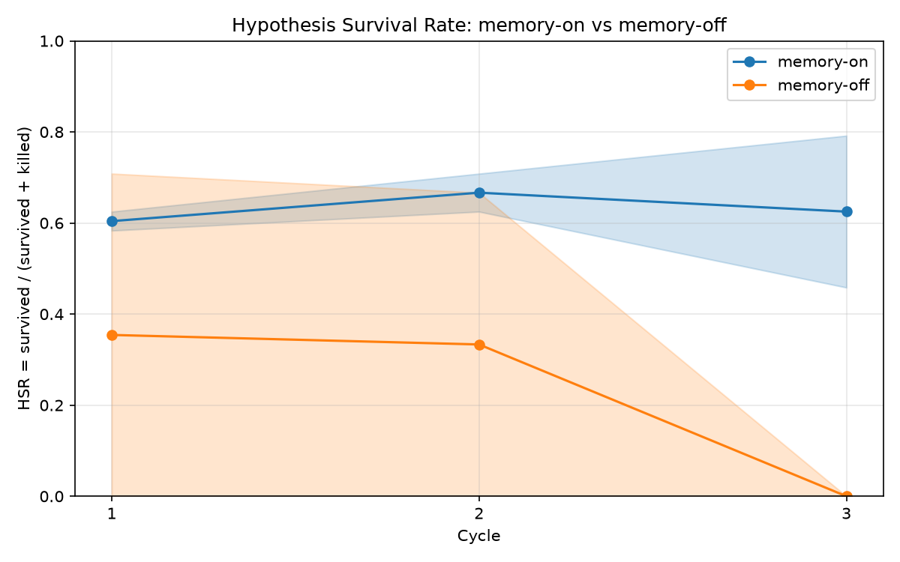

# P6 Evidence — Ablation Run 1: Off-Arm Failure Confound (Forensics)

**Date:** 2026-07-13
**Run:** `experiments/ablation/runs/20260713T115643Z/` — first full live
ablation (`8 briefs × 3 cycles × 2 arms × 2 repeats = 96 asks`, 288
hypothesis rows). **This report is forensics only: no rerun, no code
changes.**

## Headline

**The run is confounded and supports no memory claim in either
direction.** The memory-off arm ran last (arms execute sequentially), and
the Anthropic account ran out of credits 2h14m into the run, midway
through off-arm repeat 1 cycle 2. Every subsequent API call failed
instantly. Result: the on arm is clean (0 failures / 144 rows) and the
off arm lost 102 of 144 rows to billing failures that have nothing to do
with memory.

## Full results

| Arm | Cycle | HSR mean | HSR std | Survived | Killed | Failed |
|-----|-------|----------|---------|----------|--------|--------|
| on  | 1 | 0.6041 | 0.0208 | 29 | 19 | 0  |
| on  | 2 | 0.6666 | 0.0417 | 32 | 16 | 0  |
| on  | 3 | 0.6250 | 0.1667 | 30 | 18 | 0  |
| off | 1 | 0.3542 | 0.3542 | 17 | 7  | 24 |
| off | 2 | 0.3333 | 0.3333 | 12 | 6  | 30 |
| off | 3 | 0.0000 | 0.0000 | 0  | 0  | 48 |

Overall HSR (survived / decided): on = 0.6319 (144 decided), off =
**0.6905** (42 decided). The off number is *higher* — and meaningless:
HSR excludes failures by construction, so the off arm's overall figure is
computed from only the 42 asks that completed before credits died, almost
all in cycle 1. **Any cross-arm HSR contrast from this run is invalid.**



(Curve also at `experiments/ablation/runs/20260713T115643Z/ablation_curve.png`;
long-format data in `ablation_curve.csv`.)

## Task 1 — Failure autopsy

Method: joined all 288 `results.jsonl` rows to their per-arm ledger rows
(`ledger-<arm>-r<n>.jsonl`, which carry timestamps; 0 alignment
mismatches), then classified every `verdict="failed"` row against the
filesystem evidence: hypothesis files, experiment files, attached
scripts (`exp-*_script.py`), and `engine/logs/<client>/` scriptgen/run
logs.

### Failure class table

All 102 failures are a **single class**. `scriptgen.generate_script`
writes its attempt log only on success or after exhausting repairs; an
exception raised *inside the API call itself* propagates out before any
log exists. Every failed row has an experiment `.md` (created fine — no
API needed), **zero** scriptgen logs, **zero** run logs, and **zero**
attached scripts:

| Arm | Repeat | Cycle | Failure class | Count |
|-----|--------|-------|---------------|-------|
| off | 1 | 2 | api-call-exception (no scriptgen log written) | 6  |
| off | 1 | 3 | api-call-exception (no scriptgen log written) | 24 |
| off | 2 | 1 | api-call-exception (no scriptgen log written) | 24 |
| off | 2 | 2 | api-call-exception (no scriptgen log written) | 24 |
| off | 2 | 3 | api-call-exception (no scriptgen log written) | 24 |

Zero failures classified as validation rejection, script runtime error,
contract violation, or rate-limit-with-retry-trace. (The harness swallows
the exception message — `except Exception: summary = None` in
`engine/ablation.py::_run_brief` — so the class is proven structurally
plus by the live probe below.)

### Timeline — failures track wall-clock, not arm logic

Arms run strictly sequentially: on-r1 → on-r2 → off-r1 → off-r2.

```
 on r1 c1  17:27:29 .. 17:44:56   failed  0/24
 on r1 c2  17:45:43 .. 18:00:20   failed  0/24
 on r1 c3  18:01:06 .. 18:16:34   failed  0/24
 on r2 c1  18:17:15 .. 18:38:21   failed  0/24
 on r2 c2  18:39:05 .. 18:56:37   failed  0/24
 on r2 c3  18:57:24 .. 19:14:12   failed  0/24
off r1 c1  19:14:54 .. 19:30:11   failed  0/24
off r1 c2  19:30:58 .. 19:41:22   failed  6/24   <- credits die here
off r1 c3  19:41:24 .. 19:41:45   failed 24/24   <- 24 "asks" in 21 s
off r2 c1  19:41:47 .. 19:42:07   failed 24/24
off r2 c2  19:42:08 .. 19:42:34   failed 24/24
off r2 c3  19:42:35 .. 19:42:55   failed 24/24
```

- Last success: **19:41:01** (off r1 c2, ab-006). First failure:
  **19:41:15** (off r1 c2, ab-007, hyp-043). **Zero successes after the
  first failure** — a hard cliff, not intermittent throttling.
- Before the cliff, each cycle of 24 asks took 10–21 minutes. After it,
  the remaining 102 asks "completed" in ~100 seconds total — every call
  rejected instantly, which matches a billing 400 (a 429 would have shown
  mixed successes and per-window recovery over that 1h47m of healthy
  traffic beforehand).
- The failures land exclusively in the off arm **only because the off arm
  ran last**. This is the time confound in one picture.

### Corroborating fingerprint: hypgen silently degraded at the same instant

`engine/hypothesis.py` falls back to a canned template generator on any
API error (predicted winners `aligned_offering` / `focused_channel` /
`early_activation`). Template-fallback hypotheses per cell:

```
off r1 c1   0/24     on r1 c1  0/24
off r1 c2   3/24     on r1 c2  0/24
off r1 c3  24/24     on r1 c3  0/24
off r2 c1  24/24     on r2 c1  0/24
off r2 c2  24/24     on r2 c2  0/24
off r2 c3  24/24     on r2 c3  0/24
```

From the cliff onward, the off arm's "hypotheses" weren't even
Claude-generated — they were offline templates about audience alignment
being scored against JSON-parsing briefs. Those rows are not degraded
memory-off asks; they are not asks at all.

### Live credit check (minimal 1-token probe, 2026-07-13)

`ANTHROPIC_API_KEY` is set; the probe fails with exactly:

```
anthropic.BadRequestError: Error code: 400 - {'type': 'error', 'error':
{'type': 'invalid_request_error', 'message': 'Your credit balance is too
low to access the Anthropic API. Please go to Plans & Billing to upgrade
or purchase credits.'}, 'request_id': 'req_011CczE44nygq3qCeFmjxq8a'}
```

**Root cause: credit exhaustion (HTTP 400 billing error), not a rate
limit.** Same failure mode previously hit on 2026-07-07 (see `p5.md`
Task 0). Retry/backoff would not have rescued this run.

### Diff: 3 successful off-arm asks vs 3 failed ones

| | hypgen memory | predicted_winner | scriptgen logs | run logs | script attached | ledger |
|---|---|---|---|---|---|---|
| ok, off-r1 c1 ab-001 (hyp-001) | none | `stdlib_json` (real) | 1 | 1 | yes | survived, attempts=2, measurement |
| ok, off-r1 c1 ab-004 (hyp-010) | none | `exponential_jitter` (real) | 1 | 2 | yes | survived, attempts=2, measurement |
| ok, off-r1 c2 ab-003 (hyp-031) | none | `character_trigram_similarity` (real) | 1 | 1 | yes | survived, attempts=2, measurement |
| FAIL, off-r1 c3 ab-001 (hyp-049) | none | `aligned_offering` (template) | 0 | 0 | no | failed, attempts=None |
| FAIL, off-r2 c1 ab-001 (hyp-001) | none | `aligned_offering` (template) | 0 | 0 | no | failed, attempts=None |
| FAIL, off-r2 c3 ab-005 (hyp-061) | none | `aligned_offering` (template) | 0 | 0 | no | failed, attempts=None |

Arm logic is identical on both sides (memory block "none" everywhere —
the ablation lever worked). The only difference is *when the ask ran*
relative to credit exhaustion. off-r2 confirms it end-to-end: 24 hypgen
audit logs, 72 experiment `.md` files, and **zero** scriptgen logs,
run logs, or attached scripts across the entire repeat.

## Task 2 — The on arm is internally valid

Row math: 48 rows per cycle (8 briefs × 3 hypotheses × 2 repeats), 144
total, 144 unique `(repeat, cycle, brief, hypothesis)` keys, 0 failures,
0 ledger/results alignment mismatches, 0 template-fallback hypotheses.

Real memory conditioning occurred. Three injected `PAST RESEARCH
OUTCOMES` blocks from on-r1 **cycle 3** hypgen audit logs
(`engine/logs/ablation-20260713t115643z-on-r1/`):

`hypgen-brief-017-001.log` (JSON parsing):

```
PAST RESEARCH OUTCOMES (from prior experiments — calibrate on these):
- Q: Which JSON parsing approach is fastest ... | predicted: stdlib_json | actual winner: stdlib_json | verdict: survived
- Q: ... | predicted: manual_string_slicing | actual winner: manual_string_slicing | verdict: survived
- Q: ... | predicted: stdlib_json | actual winner: stdlib_json | verdict: survived
- Q: ... | predicted: stdlib_json | actual winner: regex_extraction | verdict: killed
- Q: ... | predicted: manual_string_slicing | actual winner: manual_string_slicing | verdict: survived
```

`hypgen-brief-019-001.log` (near-duplicate detection):

```
PAST RESEARCH OUTCOMES (from prior experiments — calibrate on these):
- Q: Which near-duplicate detection strategy ... | predicted: character_trigram_similarity | actual winner: token_jaccard_similarity | verdict: killed
- Q: ... | predicted: character_trigram_similarity | actual winner: character_trigram_similarity | verdict: survived
  (+ 3 more survived rows, same condition)
```

`hypgen-brief-021-001.log` (cache eviction):

```
PAST RESEARCH OUTCOMES (from prior experiments — calibrate on these):
- Q: Which cache eviction policy ... | predicted: lfu | actual winner: lfu | verdict: survived   (× 5)
```

These are real cycle-1/2 outcomes (including kills) fed into cycle-3
generation — the conditioning mechanism worked exactly as designed.

## What the on-arm data alone shows (and doesn't)

HSR per cycle: 0.6041 → 0.6666 → 0.6250. **Flat-ish; no
memory-improves-HSR claim is supportable from this either.** The cycle-3
mean hides a wide repeat split (r1 = 0.4583 vs r2 = 0.7917, std 0.1667)
— with n=2 repeats, cycle-3 HSR is anywhere from "dropped" to "rose
sharply" depending on the repeat. The honest statement: memory
conditioning demonstrably *happened* (Task 2), but whether it *helps* is
unmeasured — that was the off arm's job, and the off arm is invalid.

## Recommended rerun design (RECOMMENDATION ONLY — nothing changed yet)

1. **Kill the time confound structurally: interleave arms.** Alternate
   at the (repeat, cycle, brief) level — e.g. on/off/on/off per brief, or
   at minimum reverse arm order per repeat (on-first r1, off-first r2).
   Any wall-clock event (billing, throttling, outage) then damages both
   arms symmetrically instead of landing entirely on whichever arm runs
   last.
2. **Fail fast and loud on billing errors.** A 400
   `invalid_request_error` about credit balance is unrecoverable —
   abort the run immediately rather than recording 102 bogus "failed"
   verdicts in ~100 seconds. The bare `except Exception` in
   `_run_brief` should at minimum capture the exception type/message
   into the results row so autopsies don't have to be reconstructed
   from log absence.
3. **Retry with backoff for 429s only.** Rate limits are transient and
   worth retrying; billing 400s are not. Distinguish them.
4. **Disable hypgen's silent template fallback in live ablation runs.**
   A canned template hypothesis is not a memory-off hypothesis; it
   should raise, not degrade, when the run's purpose is measurement.
5. **Preflight credits** with a 1-token probe before launch, and
   top up enough for the full run (~576 calls) plus headroom — this is
   the third credit-exhaustion incident (2026-07-03 missing key,
   2026-07-07 empty balance, 2026-07-13 mid-run exhaustion).
6. Keep repeats ≥ 2 (ideally more): the on arm's cycle-3 std shows n=2
   is too noisy to read a trend from.

## Run 2 preflight — the four fixes are now IN the harness (2026-07-14)

The rerun recommendations above are implemented. **No rerun was launched**
(credits are still empty as of this writing). Changes:

1. **Interleaved arm ordering** (`engine/ablation.py`). Execution is now
   `for cycle → for brief → for (arm, repeat) in [(on,1),(off,1),(on,2),
   (off,2)]`, switching `SERA_LEDGER_PATH` to that arm×repeat's isolated
   ledger **per ask**. Cycle stays outermost, so an arm's full cycle N
   still completes before its cycle N+1 (memory-conditioning validity
   preserved), while arms are now time-matched within every cycle — any
   future wall-clock event hits both arms symmetrically instead of landing
   entirely on whichever ran last. Progress lines show the interleave.

2. **Abort-on-billing** (`engine/api.py::BillingError`, wired into
   `_run_brief` and the `ablate` CLI). A credit-exhaustion 400 ("credit
   balance is too low") is raised as a distinct `BillingError` that
   propagates past the per-ask `except`, halting the entire run
   immediately with a loud message. Partial `results.jsonl` and the
   per-arm ledgers remain valid (append-only). No more grinding 102 bogus
   "failed" rows in 100 seconds.

3. **429-only backoff** (`engine/api.py::call_with_backoff`, used by both
   hypgen and scriptgen). Rate-limit errors retry with exponential
   backoff (5 / 15 / 45 / 120 s, up to four retries); billing aborts;
   every other error — and a 429 that survives all retries — fails only
   that one hypothesis, and the run continues.

4. **Strict hypgen** (`engine/hypothesis.py::generate(strict=…)`). The
   ablation harness calls `strict=True`, so an API failure raises instead
   of silently backfilling a canned template — a memory-off ask is never
   again a fake "audience alignment" hypothesis scored against a
   JSON-parsing brief. Normal `sera ask` keeps `strict=False` and its
   always-works fallback, unchanged.

Tests (`tests/test_ablation_run2.py`, all offline): interleave order +
per-ask ledger switching; cycle-order preserved for memory validity;
billing → whole-run abort (and never retried); 429 → retried then
succeeds (unit + end-to-end through scriptgen); exhausted 429 → fails one
hypothesis only, run continues; strict hypgen raises where legacy falls
back; strict billing → `BillingError`. **10 new tests, all green.**

Full suite tail (`py -3.14 -m pytest -q`):

```
........................................................................ [ 52%]
..................................................................       [100%]
138 passed in 113.10s (0:01:53)
```

That is the prior 128 green plus the 10 new run-2 tests.

## Artifacts

- `experiments/ablation/runs/20260713T115643Z/` — results.jsonl,
  summary.json, ablation_curve.{png,csv}, 4 isolated ledgers
- `engine/logs/ablation-20260713t115643z-{on,off}-r{1,2}/` — hypgen
  audit logs, scriptgen attempt logs, run logs
- `vault/clients/ablation-20260713t115643z-*/` — briefs, hypotheses,
  experiments, attached scripts
- `ablation-run.log` — console progress log (UTF-16)
- `docs/evidence/p6-ablation-curve-run1.png` — the (confounded) curve
